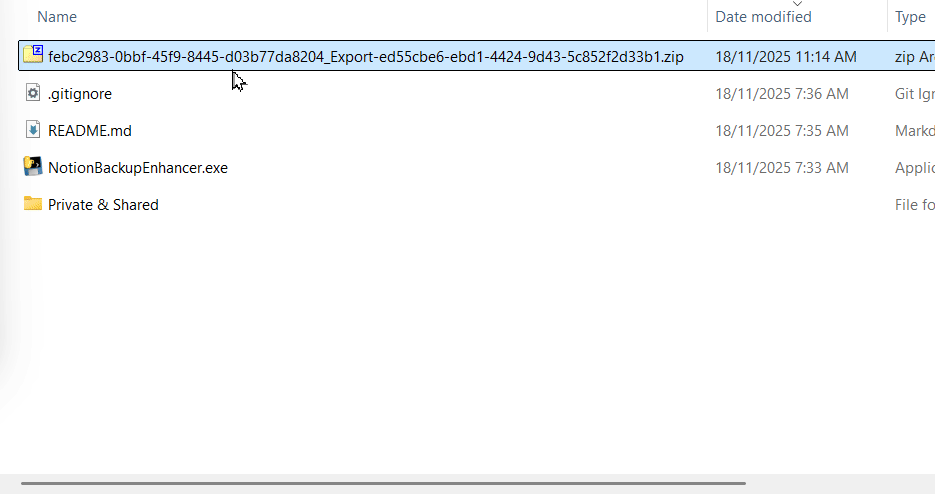
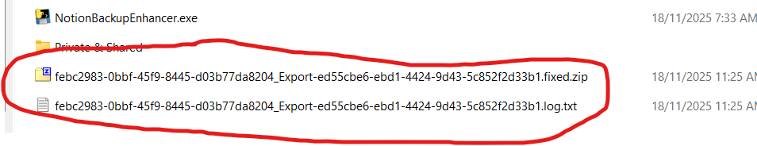

# Notion Backup Enhancer

Fixes various issues in Notion workspaces exports.

The fixed export files can be extracted into a directory and will allow for easy tracking of changes (e.g. using GitHub or another backup solution).

Simply drag and drop the Notion ZIP on the Notion Backup Enhancer executable:

And a new ZIP file will be created: 

⚠️ Note this tool is EXPERIMENTAL - please validate the generated files. Any problems you encounter, please [raise an issue](https://github.com/pureleap/notion-backup-enhancer/issues)!

Based on [notion_export_enhancer](https://github.com/Cobertos/notion_export_enhancer).

## Features

- Takes a Notion export .zip file as input
- Removes trailing 32-hex Notion IDs from filenames and directories
- Fixes links pointing to renamed files
- Handles naming collisions by appending " (i)"
- Produces a new .zip file named `<input>.fixed.zip`

## How to Use

### Step 1: Create a Notion Workspace Export

1. Open your Notion workspace
2. Click on the workspace name in the top-left corner to open the workspace menu
3. Select "Settings & members" from the dropdown
4. In the Settings tab, scroll down to find the "Export" section
5. Click on "Export all workspace content"
6. Configure the export settings:
   - **Export format**: Markdown & CSV
   - **Include Databases**: Default View
   - **Include Content**: Everything
   - **Create Folders for Subpages**: Checked (enabled)
7. Click "Export" and wait for Notion to prepare your export file
8. Once ready, download the ZIP file to your computer

### Step 2: Download the Notion Backup Enhancer

- Go to the [Releases](https://github.com/pureleap/notion-backup-enhancer/releases) page
- Download the appropriate file for your operating system:
  - **Windows**: Download the `.exe` file
  - **Mac OS X**: Download the file without extension (since I don't have a MAC, I haven't tested it - let me know if there are any issues)

### Step 3: Process the Export

- Drag and drop your Notion workspace export ZIP file onto the executable
- The tool will process the file and create:
  - A fixed ZIP file: `<your-export-filename>.fixed.zip` (in the same directory as your input file)
  - A log file: `<your-export-filename>.log.txt` (in the same directory as your input file, containing any errors or issues encountered)
- You will get a new ZIP file that has many of the issues with Notion exports resolved

## Storing Your Backups on GitHub

GitHub can serve as an excellent backup solution for your Notion exports, allowing you to track changes over time and access your backups from anywhere.

### Step 1: Create a GitHub Account
If you don't already have a GitHub account:
1. Go to [github.com](https://github.com) and click "Sign up"
2. Follow the registration process
3. Verify your email address

For detailed instructions, see GitHub's [getting started guide](https://docs.github.com/en/get-started/start-your-journey/hello-world).

### Step 2: Create a Private Repository
1. Click the "+" icon in the top-right corner and select "New repository"
2. Give your repository a name like "notion-backups" or "my-notion-exports"
3. Make sure "Private" is selected (so only you can see your backups)
4. **Important**: Uncheck "Add a README file" (we'll add our own content)
5. Click "Create repository"

### Step 3: Install Git (if needed)
You'll need Git installed on your computer. If you're not sure:
- **Windows**: Download from [git-scm.com](https://git-scm.com/download/win)
- **Mac**: Git usually comes pre-installed, or install via [git-scm.com](https://git-scm.com/download/mac)
- **Linux**: Use your package manager (e.g., `sudo apt install git`)

### Step 4: Clone Your Repository Locally
1. On your repository page, click the green "Code" button
2. Copy the URL (it will look like `https://github.com/yourusername/notion-backups.git`)
3. Open Terminal/Command Prompt on your computer
4. Navigate to where you want to store your backups (e.g., `cd Desktop`)
5. Run: `git clone [paste the URL you copied]`
6. This creates a folder with your repository name

### Step 5: Add Your Processed Backup
1. Copy your `<your-export-filename>.fixed.zip` file into the repository folder you just cloned
2. Create a `backup` subfolder in your repository (if it doesn't exist): `mkdir backup`
3. If you have a previous backup, delete the old `backup` folder: `rmdir /s backup` (Windows) or `rm -rf backup` (Mac/Linux)
4. Extract your ZIP file contents into the `backup` folder
5. You can delete the ZIP file after extracting (optional, saves space)

### Step 6: Save Your Changes to GitHub
1. Open Terminal/Command Prompt and navigate to your repository folder
2. Run: `git add .` (this stages all your files)
3. Run: `git commit -m "Add Notion backup from [today's date]"` (replace with actual date)
4. Run: `git push` (this uploads everything to GitHub)

For more detailed Git commands, see GitHub's [uploading a project guide](https://docs.github.com/en/get-started/getting-started-with-git/uploading-a-project-using-the-command-line).

**Tip**: Repeat Steps 5-6 whenever you create a new backup. GitHub will keep a history of all your changes, so you can see what changed between backups and easily restore previous versions.
